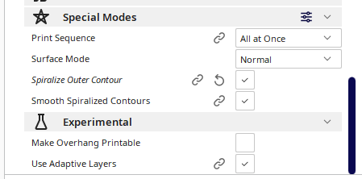
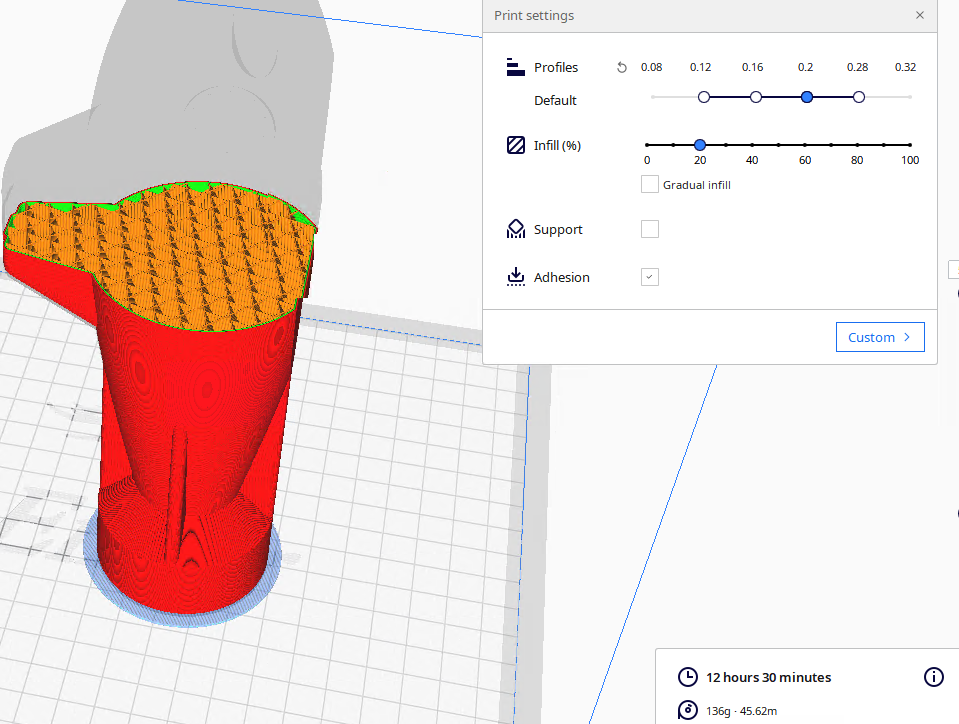
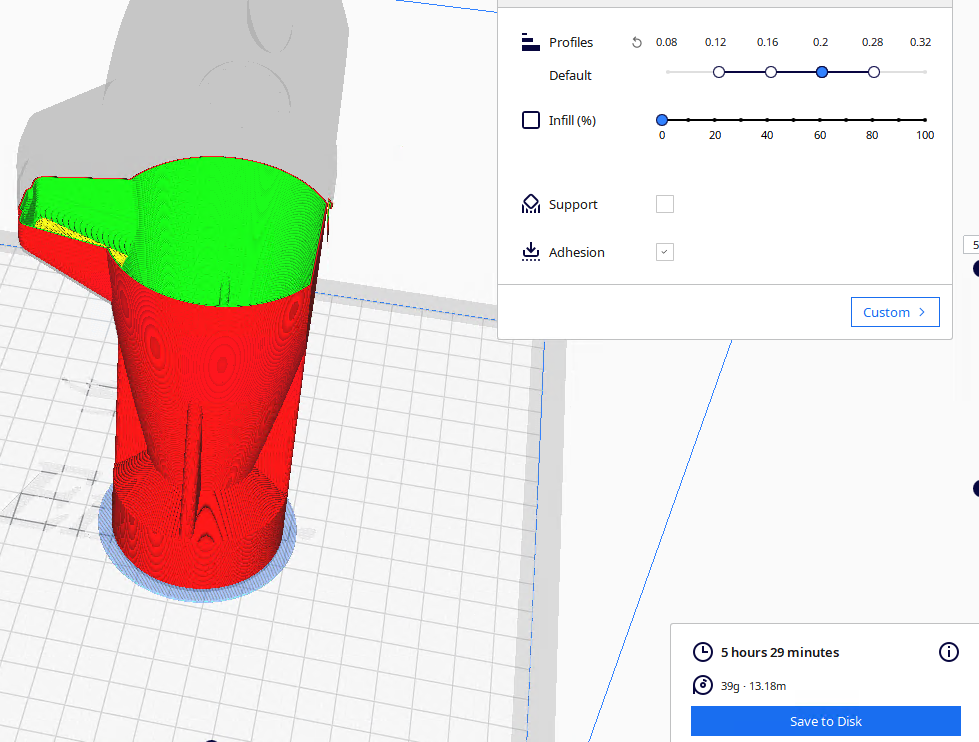
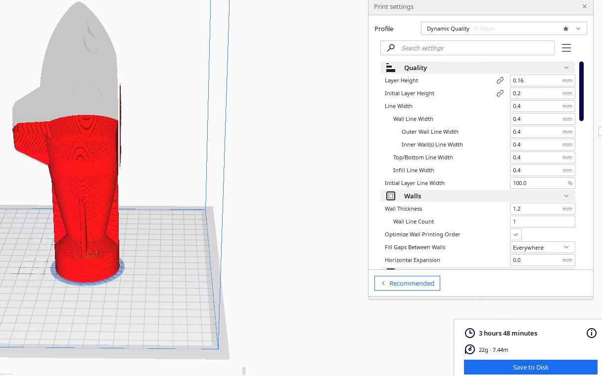
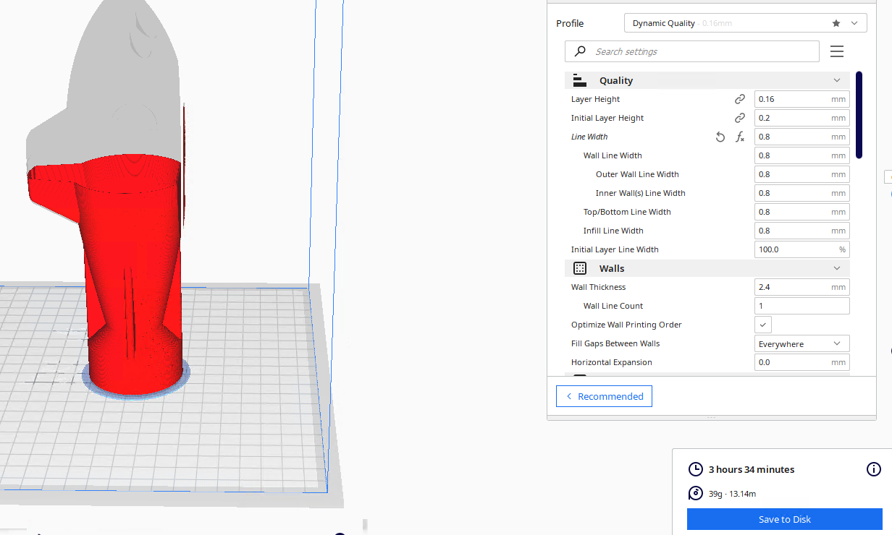
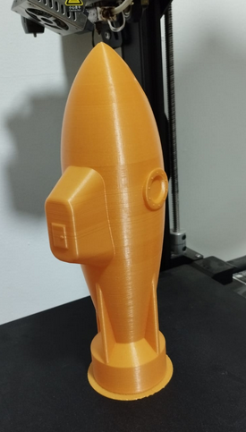

# about


```
				gram	meter 	hr
regular mode	(fill)
		20%		136	46	12:30
		0%		39	13	5:29


vase mode	(wall)
		0.4		22	7	3:48
		0.8		39	13	3:34


```

## comapre

mode config


regular print mode ; 0.2/20%
  

0 fill regular mode


vase mode - default 0.4 wall
 

vase mode - duble wall - 0.8



## print

vase mode - duble wall - 0.8


